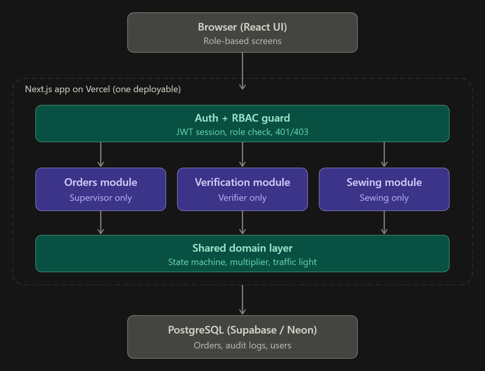

# ApparelFlow ERP — Gatekeeper

A production **batch verification gate** for a garment factory. Cutting orders move from the cutting floor to the sewing line only after a verifier counts every component against the recipe's bill of materials — with a strict, database-enforced state machine and an immutable audit trail.

Built as a **modular monolith**: one Next.js deploy, thin API route handlers, pure shared business rules in `domain/`, and a Supabase Postgres database that enforces the lifecycle at the schema level (triggers, checks, row-level security).

**Live URL:** https://apparelflow-gatekeeper-lovat.vercel.app

**Repository:** https://github.com/VMANFdo/Apparelflow-Gatekeeper

---

## Table of contents

- [Who is this for](#who-is-this-for)
- [Features](#features)
- [Architecture](#architecture)
- [Why a modular monolith (and not ESB / microservices)](#why-a-modular-monolith-and-not-esb--microservices)
- [Tech stack](#tech-stack)
- [Database schema](#database-schema)
- [Order lifecycle (state machine)](#order-lifecycle-state-machine)
- [API reference](#api-reference)
- [Security](#security)
- [Getting started](#getting-started)
- [Demo credentials](#demo-credentials)
- [Roadmap](#roadmap)

---

## Who is this for

The app has three roles, each with its own dashboard:

| Role | What they do |
|---|---|
| **Cutting Supervisor** | Creates cutting orders from recipe blueprints, sees order status at a glance, resubmits rejected orders |
| **Cutting Verifier** | Counts pieces per component, approves or rejects batches (the "gatekeeper") |
| **Sewing Supervisor** | Starts garment assembly on verified batches, sees wastage alongside the handoff |

---

## Features

- **Role-based sign-in & one-click demo accounts** — httpOnly cookie session, 8-hour JWT, live role switcher in the header.
- **Order creation from recipes** — the server computes expected piece counts and expected fabric from the recipe multiplier and snapshots them per order.
- **Supervisor dashboard cards** — a summary strip of four filter cards: **Total / Pending / Verified / Rejected**. Each card shows a live count and acts as a filter — click it to narrow the order table. Click the active card again to clear the filter.
- **Verifier terminal** — per-order counting with a live traffic-light (GREEN / YELLOW / RED / UNCOUNTED) updated from the same rules the server uses, plus a server hard stop that returns `422` on any shortage or uncounted row.
- **Verifier history tables** — the verifier page lists **Verified** orders (order, verifier, wastage %) and **Rejected** orders (attempt number and the rejection reason) pulled from the immutable `verification_logs` audit trail — see [Verifier history](#verifier-history).
- **Sewing handoff** — verified batches appear in the sewing queue only (hard-coded `status = 'VERIFIED'`); detail view shows piece variances, verifier, wastage (flagged but never blocking) and the approval note.
- **Accessibility & responsiveness** — WCAG AA contrast, visible focus rings, colour is never the only status indicator, tables collapse to cards on mobile.

### Verifier history

The queue page is backed by the immutable `verification_logs` table, so a verifier can always see what happened and why:

- **Verified orders** — order no., recipe, verifier, decision date and the computed **wastage %**.
- **Rejected orders** — order no., recipe, **attempt number** (e.g. `#2`), the supervisor-facing **reason**, and the rejection date.

Because logs are append-only at the database level (a trigger blocks `UPDATE`/`DELETE`), this history is trustworthy for audits.

---

## Architecture



*Figure 1: System architecture overview.*

```
┌───────────────────────────────────────────────────────────────────────┐
│                   Next.js App Router (single deployment)              │
│                                                                       │
│   Browser — role UIs (supervisor / verifier / sewing)                 │
│      │                                                                │
│      ▼                                                                │
│   src/app   pages + thin /api/* route handlers                        │
│      │      parse → guard → call service → map error to HTTP          │
│      ▼                                                                │
│   src/server                                                          │
│      • auth/session.ts   JWT (jose, HS256), httpOnly cookie           │
│      • auth/guard.ts     requireRole + same-origin check              │
│      • services/*        orders, verification, sewing, recipes        │
│      • http/handler.ts   { error: { code, message, details } }        │
│      ▼                                                                │
│   src/domain   PURE rules, imported by client AND server              │
│      stateMachine.ts  verification.ts  orders.ts  wastage.ts          │
│                                                                       │
│   db/  schema.ts (Drizzle) + migrations (0000 schema, 0001 SQL)       │
│      triggers · CHECK constraints · partial unique index · RLS        │
│      ▼                                                                │
│   Supabase Postgres  (plain Postgres — no Supabase Auth)              │
│                                                                       │
│   tests/  Vitest + PGlite — replays the real migrations + triggers    │
└───────────────────────────────────────────────────────────────────────┘
```

**How the layers cooperate**

- **`app/`** — pages (server components that fetch through services) and route handlers. Handlers stay thin: parse the body, guard the role, delegate to a service, map errors.
- **`domain/`** — the single source of truth for business rules (state transitions, component verdicts, wastage). It is pure TypeScript with **no I/O**, so the same `evaluateComponent` that colours a row in the browser is the one the server trusts.
- **`server/`** — auth sessions, role guards and the services that own every transaction. Services re-read state from the database inside `SELECT … FOR UPDATE` transactions; nothing from the request body is ever trusted.
- **`db/`** — Drizzle schema plus hand-written SQL migration `0001` that adds triggers, CHECK constraints, the partial unique index and row-level security.
- **`tests/`** — Vitest against an in-memory **PGlite** Postgres that applies the same migrations and triggers as production. `npm test` needs no environment variables and never touches real data.

---

## Why a modular monolith (and not ESB / microservices)

The system was deliberately built as a modular monolith. The alternatives were rejected for concrete reasons:

### ESB (Enterprise Service Bus)

An ESB inserts a central message broker with adapters, routing and message-translation layers between every participant. For a 3-role domain with six tables and no external integrations, the ESB adds:

- A single point of failure and an extra network hop on every call.
- A protocol/logic layer (adapters, canonical models) with almost no work to do.
- Orchestration and deployment complexity that outweighs the entire feature set.

Nothing here needs an integration backbone — one team, one deployable, one datastore.

### Microservices / SOA

Splitting orders, verification and sewing into separate services sounds tempting, but the **domain is one atomic state machine**, not independent services:

- Approving an order must atomically: write the audit log (+ variance snapshot + wastage %), freeze the counts, and flip the status. Splitting this across services turns a single ACID transaction into distributed-transaction choreography.
- Microservices add network failure modes, per-service auth, and duplicate rule sets. The cost is real; the bounded context we gain is… the three roles of one factory.

### Why the modular monolith wins here

- **One deploy, one source of truth** — the `domain/` rules compile into both the browser and the server, so the UI preview and the hard stop can never drift.
- **ACID where it matters** — the approve/reject flows rely on Postgres transactions + row locks + triggers, which microservices would force us to give up.
- **Defense in depth at the schema** — triggers and CHECK constraints run *under* the application, so even a buggy handler cannot write an illegal state.
- **Testable** — PGlite replays the real schema and triggers in-memory, so the tests exercise production rules (trigger tests included).
- **Evolvable** — the modules are already cleanly bounded (`domain/`, `server/services/`, `db/migrations/`). If the product ever grows large enough, any module can be extracted into a service without rearchitecting the others.

> The counter-argument (a monolith can't scale independently) is real — but for this workload the scaling boundary is the database, which a single Postgres instance serves comfortably, with serverless scaling on top via Vercel + Supabase.

---

## Tech stack

| Layer | Choice |
|---|---|
| Framework | Next.js 16 (App Router) + React 19 + TypeScript |
| Database | Supabase Postgres, used as plain Postgres |
| ORM | Drizzle ORM + `postgres` driver (works with the Supabase pooler on serverless) |
| Auth | `bcryptjs` + `jose` JWT (HS256) in an httpOnly cookie |
| Validation | Zod (shared by client forms and server routes) |
| UI | Tailwind CSS v4, Radix UI primitives, lucide-react, Geist font |
| Tests | Vitest + PGlite (in-memory Postgres with the real migrations + triggers) |

---

## Database schema

Six tables. Enums: `role`, `order_status`, `item_status`, `decision`.

| Table | Purpose | Key columns |
|---|---|---|
| `users` | Auth accounts + login throttling | `id`, `email` (unique), `password_hash` (bcrypt), `role`, `full_name`, `is_active`, `failed_attempts`, `locked_until`, `created_at` |
| `recipes` | Garment blueprint | `id`, `recipe_code` (unique), `name`, `category`, `std_fabric_yards`, `wastage_cap` |
| `recipe_components` | Bill of materials per recipe | `id`, `recipe_id` → `recipes`, `component_name`, `pieces_per_garment`, `image_url` |
| `cutting_orders` | A cutting batch / lot | `id`, `order_no` (unique, `CO-YYYY-NNNN`), `recipe_id`, `target_qty`, `fabric_roll_id`, `actual_fabric_yds`, `expected_fabric_yds` (snapshot at creation), `status`, `created_by`, `sewing_started_at`, `sewing_started_by`, timestamps |
| `verification_items` | One counted row per (order, component) | `id`, `order_id` → `cutting_orders`, `component_id` → `recipe_components`, `expected_qty`, `actual_qty` (**NULL = uncounted**), `status` |
| `verification_logs` | Immutable audit trail | `id`, `order_id`, `verifier_id`, `decision`, `rejection_note`, `approval_note`, `wastage_pct`, `variance_snapshot` (jsonb), `attempt_no`, `created_at` |

### Database-level safeguards

Applied by the hand-written `0001_triggers_rls.sql` migration:

- **Immutable logs** — a trigger blocks `UPDATE`/`DELETE` on `verification_logs`.
- **Frozen counts** — a trigger blocks `UPDATE` on `verification_items` once the parent order is `VERIFIED`.
- **Valid transitions only** — a trigger rejects any illegal `cutting_orders.status` change.
- **CHECK constraints** — `target_qty`, `pieces_per_garment`, fabric yards `> 0`; `actual_qty >= 0`; a `REJECTED` log must have a non-empty `rejection_note`.
- **One approval per order** — a partial unique index allows at most one `APPROVED` log per order.
- **Row-level security** — enabled on all six tables **with no policies**, so Supabase's public/anon API can't read anything; only the server's direct connection can.

---

## Order lifecycle (state machine)

```
                       approve
        ┌────────────────────────────► VERIFIED ──────────► start sewing
        │                                                    (status stays VERIFIED,
PENDING_VERIFICATION                                          sewing_started_at set)
        │
        └─ reject (reason required) ─► REJECTED
                                          │
                                          │  supervisor resubmits
                                          ▼
                                   PENDING_VERIFICATION
```

| From | To | Action |
|---|---|---|
| `PENDING_VERIFICATION` | `VERIFIED` | Verifier approves (all rows GREEN/YELLOW) |
| `PENDING_VERIFICATION` | `REJECTED` | Verifier rejects with a reason |
| `REJECTED` | `PENDING_VERIFICATION` | Supervisor resubmits (counts reset) |

`VERIFIED` has **no outgoing transitions** — starting sewing is recorded on the order (`sewing_started_at/by`) without changing the status. The same map lives in `domain/stateMachine.ts` and in the `enforce_status_transition()` trigger, so an illegal transition is rejected even if the application is bypassed.

### Component verdict rules

Per component, `evaluateComponent(expectedQty, actualQty)`:

| Condition | Verdict | Effect |
|---|---|---|
| `actual_qty` is `NULL` | **UNCOUNTED** | Blocks approval (`422`) |
| `actual_qty` = `expected_qty` | **GREEN** (Match) | OK |
| `actual_qty` > `expected_qty` | **YELLOW** (+N Surplus) | Allowed |
| `actual_qty` < `expected_qty` | **RED** (−N Shortage) | Blocks approval (`422`) |

There is **no percentage tolerance** on components — GREEN/YELLOW/RED is exact. (The recipe `wastage_cap` — e.g. 5% or 8% — is a *wastage* warning only, never a count tolerance.)

### Wastage

`wastage_pct = round2((actual_fabric_yds − expected_fabric_yds) / expected_fabric_yds × 100)`, computed against the `expected_fabric_yds` snapshot taken at order creation and stored on the approval log.

### Verification audit workflow

The verifier terminal separates **Save counts** from the final decision so the database remains the audit source of truth:

1. The verifier enters or clears component counts and selects **Save counts**.
2. The server validates every submitted component, computes its status, and persists the count snapshot. A cleared field is stored as `NULL` (UNCOUNTED).
3. **Approve** and **Reject** become available only after a successful save. Their requests do not contain counts; the server re-reads the persisted rows inside the decision transaction.
4. Approval is allowed only when every persisted component is GREEN or YELLOW. RED or UNCOUNTED components return `422` and remain pending.
5. Rejection requires a 5–500 character reason and records the saved count snapshot, including incomplete counts, in the immutable verification log.

This prevents unsaved browser values from becoming audit data and lets a verifier deliberately save an incomplete count set before rejecting a batch.

---

## API reference

All route handlers declare `export const runtime = 'nodejs'` and `export const dynamic = 'force-dynamic'` (always executed on the server, with no caching on the audit-critical endpoints).

| Method | Endpoint | Role | Success | Key errors |
|---|---|---|---|---|
| `POST` | `/api/auth/login` | public | `200` | `400` validation, `401` bad credentials |
| `POST` | `/api/auth/logout` | authenticated | `200` | |
| `GET` | `/api/auth/me` | authenticated | `200` | `401` |
| `GET` | `/api/health` | public | `200` | `503` DB down |
| `POST` | `/api/orders` | cutting_supervisor | `201` | `400`/`401`/`403`/`404`/`422` |
| `GET` | `/api/orders` | cutting_supervisor, cutting_verifier | `200` | `401`/`403` |
| `POST` | `/api/orders/:id/resubmit` | cutting_supervisor | `200` | `400`/`401`/`403`/`404`/`409` |
| `GET` | `/api/recipes` | cutting_supervisor, cutting_verifier | `200` | `401`/`403` |
| `PUT` | `/api/verification/:orderId/counts` | cutting_verifier | `200` | `400`/`401`/`403`/`404`/`409` |
| `POST` | `/api/verification/:orderId/approve` | cutting_verifier | `200` | `400`/`401`/`403`/`404`/`409`/`422` |
| `POST` | `/api/verification/:orderId/reject` | cutting_verifier | `200` | `400`/`401`/`403`/`404`/`409` |
| `GET` | `/api/sewing/queue` | sewing_supervisor | `200` | `401`/`403` |
| `GET` | `/api/sewing/queue/:id` | sewing_supervisor | `200` | `400`/`401`/`403`/`404` |
| `POST` | `/api/sewing/:id/start` | sewing_supervisor | `200` | `400`/`401`/`403`/`404`/`409` |

### HTTP status convention

| Code | Meaning |
|---|---|
| `400` | Zod schema / body validation failed |
| `401` | No valid session |
| `403` | Wrong role for this endpoint |
| `404` | Not found — or not visible to this role |
| `409` | Invalid state transition (e.g. re-approve, resubmit a non-rejected order) |
| `422` | Business-rule hard stop (e.g. RED / UNCOUNTED components) |
| `500` | Unexpected error (generic message, no internals leaked) |

---

## Security

The database, the services and the HTTP layer each enforce the rules independently (defense in depth).

- **Role guards in every handler** — `requireRole(...)` returns `401` without a session and `403` for the wrong role. Page-level redirects exist only for UX; the API is the boundary.
- **Same-origin check on mutations** — every `POST/PUT/PATCH/DELETE` is rejected if an `Origin` header doesn't match the host (absent origin — cURL/Postman — is allowed).
- **Session** — JWT (HS256) signed with `AUTH_SECRET` in an httpOnly, `SameSite=Lax`, `Secure` (prod) cookie with an 8-hour lifetime. The user row — including `role` and `is_active` — is re-read from the DB on every request, so a deactivated user takes effect immediately regardless of token expiry.
- **Server is the authority** — counts and statuses are recomputed server-side; `actual_qty`/status in the body are never trusted. Approve re-reads counts from the DB inside a `SELECT … FOR UPDATE` transaction, so double-approve and lost updates are impossible.
- **Actor identity from the session** — verifier/decision timestamps and `sewing_started_by` come from the session, never the request body.
- **Sewing queue is hard-specified** — the query literal is `WHERE status = 'VERIFIED'`; detail returns `404` for anything else.
- **Database triggers & RLS** — see [Database-level safeguards](#database-level-safeguards).
- **Login hardening** — one generic `Invalid email or password` message, a dummy bcrypt compare against unknown emails (no timing oracle), and a 5-failure / 15-minute per-account lockout persisted in the DB.
- **Strict, bounded input** — Zod on every endpoint; integer fields capped (e.g. `target_qty` 1–100,000, counts 0–1,000,000); `loginSchema.strict()` rejects unknown/tampered keys.
- **Sanitised errors** — the HTTP handler maps known errors to their code and returns a generic `500` for anything unexpected; stack traces only reach the server log.
- **Headers** — `Content-Security-Policy`, `X-Content-Type-Options: nosniff`, `Referrer-Policy: strict-origin-when-cross-origin` (via `next.config.ts`).
- **No Supabase Auth / no anon key** — the database is reached only through server code; there is no `supabase-js` or service-role key anywhere in the bundle.

---

## Getting started

A stranger can run this project end-to-end locally. You need **Node 20+** and a **Postgres** database (a free Supabase project works; any Postgres 14+ does too).

### 1. Clone and install

```bash
git clone https://github.com/VMANFdo/Apparelflow-Gatekeeper.git
cd Apparelflow-Gatekeeper
npm install
```

### 2. Environment variables

```bash
cp .env.example .env.local
```

| Variable | Purpose |
|---|---|
| `DATABASE_URL` | App runtime connection — Supabase **transaction pooler** (port `6543`) |
| `DIRECT_URL` | **Migrations only** — Supabase **session pooler** (port `5432`) |
| `AUTH_SECRET` | JWT signing secret. Generate: `openssl rand -base64 32` |

> In Supabase, copy both connection strings from **Project → Connect**. The transaction pooler (6543) goes to `DATABASE_URL`, the session pooler (5432) to `DIRECT_URL`. Never prefix these with `NEXT_PUBLIC_`.

### 3. Migrate and seed

```bash
npm run db:migrate   # applies db/migrations (schema + triggers + RLS)
npm run db:seed      # idempotent: 3 demo users, 2 recipes, 3 demo orders
```

### 4. Test

```bash
npm test             # Vitest + PGlite — no env vars or database needed
```

### 5. Run

```bash
npm run dev          # → http://localhost:3000
```

Other scripts: `npm run build` / `npm start` (production), `npm run lint`, `npm run db:generate` (Drizzle migrations from `db/schema.ts`).

---

## Demo credentials

All three accounts sign in through the real authentication endpoint. The login page also shows one-click **"Sign in as"** buttons for each role.

| Role | Email | Password |
|---|---|---|
| Cutting Supervisor | `supervisor@apparelflow.demo` | `Supervisor@123` |
| Cutting Verifier | `verifier@apparelflow.demo` | `Verifier@123` |
| Sewing Supervisor | `sewing@apparelflow.demo` | `Sewing@123` |

The seed also creates three demo orders: `DEMO-ROLL-A` (pending verification), `DEMO-ROLL-B` (rejected — see it resubmit), and `DEMO-ROLL-C` (verified).

---

## Roadmap

Task tracking, including every commit and branch, lives in [`TASKS.md`](TASKS.md). The remaining work and known gaps are documented there; see also [`System Implementation Plan.md`](System%20Implementation%20Plan.md) for the original 4-day plan and [`AI_OPTIMIZATION_REPORT.md`](AI_OPTIMIZATION_REPORT.md) for the AI collaboration log.